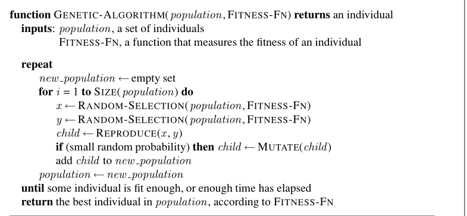

<<<<<<< HEAD
=======
# Gen-Algo-For-Delivery-System
GENETIC ALGORITHM FOR DELIVERY SYSTEM : Inspired by nature’s process of eliminating things that don’t work, and progressing with things that work. 
We work with a population of individuals — each individual is basically a solution to the problem. We pick the individuals who seem to be better solutions, and use those to create a new population. 
And repeat this process.
 Genetic Algorithm is a type of search algorithm that mimics the process of biological evolution. Instead of just looking at one possible solution at a time, a GA maintains a whole population of possible solutions (called "individuals" or "states"). Over many generations, it combines the best solutions and adds random changes to produce progressively better populations, hopefully converging on an excellent solution. 

 How the Algorithm Flows : 

 A. Start with a Population: We begin with an initial set of solutions. These are often created randomly. 

 B. Evaluate Fitness: Each individual(solution) is scored by a Fitness Function to determine how good it is at solving the problem. 

 C. Select Parents: The algorithm then selects individuals to be "parents" for the next generation. This selection is not random; individuals with higher fitness scores have a better chance of being chosen.

 D. Create Offspring (Crossover & Mutation): Crossover: The "genes" of two parent individuals are combined to create a new individual, the "offspring." This is like inheriting traits from both parents. Mutation: A small, random change is introduced into the offspring's genes. This ensures genetic diversity and helps the algorithm avoid getting stuck. 
 
 E. Form a New Population: The offspring created from this process form the next generation. This new population replaces the old one, and the entire cycle repeats.

 PSEUDOCODE:

 
 Ref: Artificial Intelligence: A Modern Approach by Russell and Norvig ChapterNo.4 Section 4.2 Page no 129

 1.Function GENETIC-ALGORITHM(population, FITNESS-FN) returns an individual: The function takes a list of solutions (population) and a scoring function (FITNESS-FN) as its input. It promises to return a single, good solution (an individual). 

 2.Repeat new_population ← empty set: It starts a loop that will continue until a stopping condition is met. In each loop, it prepares to build a brand new population. 
 
 3.for i = 1 to SIZE(population) do x ← RANDOM-SELECTION(population, FITNESS-FN) y ← RANDOM-SELECTION(population, FITNESS-FN): This for loop will run enough times to create a new population of the same size as the old one. Inside the loop, it selects two parents, x and y. RANDOM-SELECTION doesn't mean purely random; it means individuals with a higher fitness score have a proportionally higher chance of being selected. 
 
 4.Child ← REPRODUCE(x, y): This is the crossover step. The REPRODUCE function takes the two parents (x and y) and combines their information to create a new solution, child. 
 
 5.If (small random probability) then child ← MUTATE(child): This is the mutation step. There's a small chance (e.g., 1%) that the child will be slightly altered. This prevents the population from becoming too uniform and helps explore new possibilities. 
 
 6.Add child to new_population population ← new_population: The newly created child is added to the new_population. After the for loop finishes, the old population is completely replaced by this new_population. 
 
 7.Until some individual is fit enough, or enough time has elapsed: This is the stopping condition. The repeat loop will keep running, creating generation after generation, until either a solution is found that is good enough, or a pre-set limit (like 1000 generations or something) is reached. 
 
 8.Return the best individual in population: Once the loop stops, the function searches through the final population and returns the single best individual it found.

Summary:Genetic Algorithm tells us to start with a random bunch of solutions and, through a repeated process of scoring (fitness), choosing the best (selection), mixing them up (crossover), and randomly tweaking them (mutation), we can "evolve" a high-quality solution to a complex problem.
>>>>>>> a8d8553 (Updated The README File)
